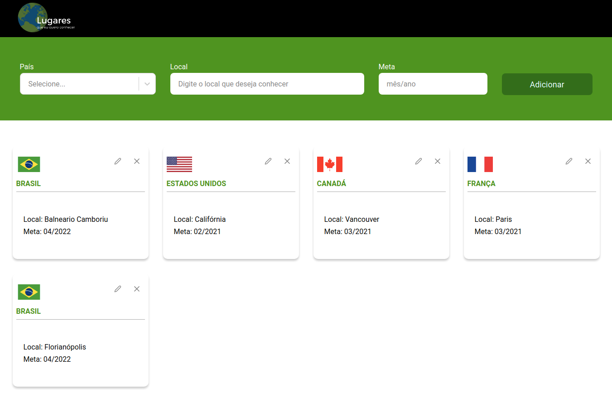

<h1 align="center">Lugares que eu quero conhecer</h1>

 

  

 

## 🚀 Começando

### Requisitos

- [NodeJS](https://nodejs.org/en/)
- [Yarn](https://yarnpkg.com/) ou [NPM](https://www.npmjs.com/)

1. Clone este repositório usando: `git clone https://github.com/orenatodos/frontend-challenge.git`
2. Mova para o diretório apropriado: `cd frontend-challenge`.  
3. Execute `yarn` ou `npm install` para instalar as dependências.  
4. Execute `npx json-server db.json --port 3333` para subir o servidor de Locais 
5. Execute `yarn start` ou `npm start` para visualizar o projeto em: `http://localhost:3000`.

---

Feito com ♥ por Renato Silva 👋 [Entre em contato!](https://www.linkedin.com/in/orenatodos/)
